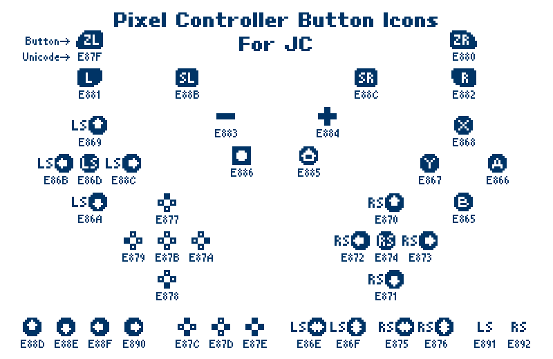
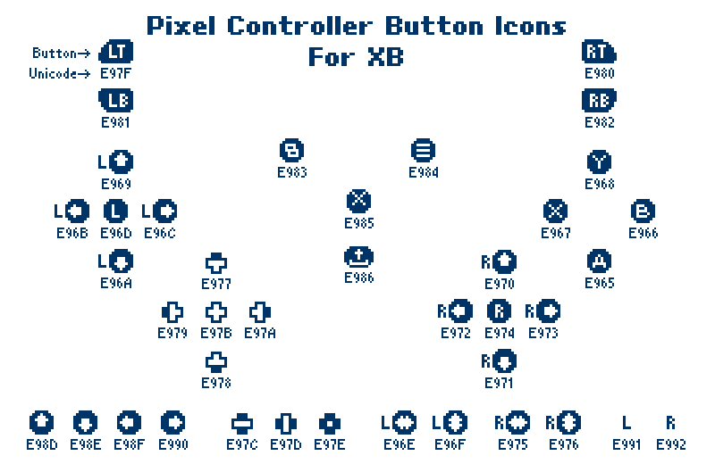
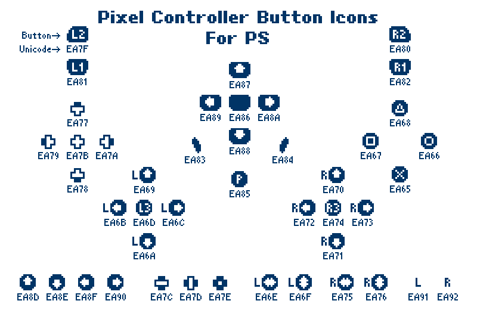

# BoutiqueBitmap9x9／精品點陣體9×9／精品点阵体9×9

 《精品點陣體9×9 (BoutiqueBitmap9x9) 》家族是一款基於M+ BITMAP FONTS及ベストテン（BestTen-DOT）改作的字型，并以[缝合像素字体](https://github.com/TakWolf/fusion-pixel-font)作作為字符補充，目的為適合在繁體中文環境中使用。我們改正了一些標點符號、日本習慣寫法、增加大量字符與Opentype特性——包括顏文字用符號、簡體中文、直排特性等——使字型使用更方便！

這是一款帶有極強烈的點陣風格的字型，非常適合用在像素畫、遊戲相關主題等等。

查看完整的介紹、後記等請麻煩移駕至[鄙人的部落格（博客/Blog）](https://fontspeech.blogspot.com/)。

## 版本說明

|檔案名稱|字型名稱|說明|
|-------|-------|------|
|BoutiqueBitmap9x9_1.93.ttf|精品點陣體9x9 1.93 R|此為《精品點陣體9x9》【普通版】，適合絕大多數使用場景。收錄了遊戲手柄按鈕字符、一共12,858個字符，包括繁簡體與台客閩粵常用字。字型內香港字僅支援新版香港增補字符集（ISO 10646）編碼。|
|BoutiqueBitmap9x9_Bold_1.93.ttf|精品點陣體9x9 1.93 B|此為《精品點陣體9x9》【普通版粗體】，說明與上者相同。|
|BoutiqueBitmap9x9HK_1.93.ttf|精品點陣體9x9港 1.93 R|此為《精品點陣體9x9》【香港版】，收錄字數與普通版一致，字型內之香港字同時支援新舊版香港增補字符集（GCCS+HKSCS+ISO 10646）編碼，適合用於無法支援基本多文種平面外之字符的系統及軟件中。因與早期版本精品點陣體9x9遊戲手柄按鈕字符撞碼，特修改港版字型之遊戲手柄按鈕編碼，修正方式詳見《遊戲手柄按鈕字符》港版備註。|
|BoutiqueBitmap9x9HK_Bold_1.93.ttf|精品點陣體9x9港 1.93 B|此為《精品點陣體9x9》【香港版粗體】，說明與遊戲手柄按鈕字符編碼與上者相同。|

## 遊戲手柄按鈕字符

本字型收錄了３款主流遊戲主機手柄的按鈕符號，可以方便開發者使用。具體按鈕的Unicode編碼及示範效果如下：

- ＪＣ：

- ＸＢ：

- ＰＳ：

- 示範：

|港版備註|
|-------|
|為配合香港增補字符集編碼，特為港版字型調整所有遊戲手柄按鈕字符編碼。所有修改邏輯如下：|
|【For JC】原先以E8為開頭的按鍵全數修改為EF開頭。  　舉例：原先Ａ鍵為E866，港版字型為EF66。|
|【For XB】原先以E9為開頭的按鍵全數修改為F0開頭。  　舉例：原先Ｂ鍵為E966，港版字型為F066。|
|【For PS】原先以EA為開頭的按鍵全數修改為F1開頭。  　舉例：原先○鍵為EA66，港版字型為F166。|

## 授權

- 本字型基於 [SIL Open Font License 1.1](https://scripts.sil.org/OFL) 授權條款公開發布。關於授權合約的詳細內容，請詳讀授權文件檔（OFL.txt）。

  - **BoutiqueBitmap**、**精品點陣體**、**精品点阵体**為本專案的保留名稱。
  - 任何人可以無償使用此字型，包含商用。無須告知原作者。
  - 您可自由傳送、分享此字型，或與其他軟體綑綁發行、銷售。捆包中必須同時包含授權文件檔（OFL.txt）。
  - 您可自由改造、衍生此字型並公開。修改後的字型必須同樣以 [SIL OFL](https://scripts.sil.org/OFL) 進行發布，勿使用字型的保留名稱。
  - 依照 [SIL OFL](https://scripts.sil.org/OFL) 規定，**禁止單獨出售字型檔**。

 ## 贊助

 - 如果喜歡我們的字型，覺得我的字型對你很有幫助，歡迎抖內。您的支持是給予我們製作更多中文字型的能量（及零食的熱量）🥰：
   
[贊助網址](https://core.newebpay.com/EPG/boutiquebitmap/aQJIdj) 

 

